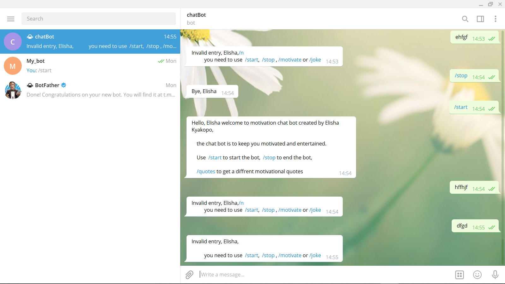

# Telegrame-bot-capstone

> ### This bot is designed to send daily motivational messages and tell facts about things you didn't know every time the user types /start

## Built With
1.	__Ruby__ 
2.	__Rubocop__
3.	__Rspec__
4.	__telegram-bot-ruby library__

## Getting Started
To get a local copy up and running follow these simple example steps.

Open the terminal and type
git clone https://github.com/elisha2kyakpo1/telegram-bot-capstone
 
## To use the bot:
> type cd telegram-bot-capstone 
### Followed by:

> main.rb

1. Download telegram on your system
2. search for @morning_motivate_bot to chat with the bot.
3. Enter /start and follow instructions

# Enjoy Amazing benefits of the bot!

__Here is an image to guide you how to use the bot:__

# Installation
Add following line to your Gemfile:

> gem 'telegram-bot-ruby'
> gem 'json'
> gem 'net-http-persistent', '~> 2.9', '>= 2.9.4'
> gem 'telegram-bot-ruby'

And then execute:

> $ bundle

You will need an API KEY to communicate with bot
# Here is one you can use, and don't misuse it.

## Author

👤 **Elisha Kyakopo**

- GitHub: [elisha2kyakpo1](https://github.com/elisha2kyakpo1)
- LinkedIn: [Elisha Kyakopo](https://www.linkedin.com/in/elisha-kyakopo-009aa3197/)

## 🤝 Contributing

Contributions, issues, and feature requests are welcome!

## **Contributing**

Contributions, issues and feature requests are welcome! Start by:

- Forking the project
- Cloning the project to your local machine
- cd into the project directory
- Run git checkout -b your-branch-name
- Make your contributions
- Push your branch up to your forked repository
- Open a Pull Request with a detailed description to the development branch of the original project for a review

## Show your support

Give a ⭐️ if you like this project!
